# plan_form_v2: formr's survey engine, v2

Branch: `feature/form_v2` (off `master` at v0.25.1). Not yet merged.

This file was originally a design spec. Phases 0–5 have since landed on the branch, so it has been rewritten to describe what exists, what doesn't, and what's next. Day-to-day dev gotchas live in `CLAUDE.md` under "form_v2 development notes"; this file keeps only the architectural decisions and the remaining-work list.

---

## 1. Status at a glance

Phases 0–5 are code-complete on-branch (with gaps noted below). Phases 6 (docs + parity gate) and the rollout gates are still open.

| Phase | Status | Notes |
|---|---|---|
| 0 — Plumbing | ✅ done | `Form` RunUnit, `rendering_mode` column, `form_v2_enabled` flag |
| 1 — Single-page AJAX form | ✅ done | FormRenderer, Alpine, BS5, form-page-submit |
| 2 — Item-type coverage | ✅ done bar A/V smoke | PWA items wired vanilla; only audio/video need in-browser capture smoke |
| 3 — Client-side showif (JS only) | ✅ done | Alpine-driven; r() in showif is invalid; bridge via hidden field with r() value |
| 4 — Page-scoped value + label resolution | ✅ done | r(...) on value (only); label slot for embedded Rmd; first-page resolved server-side, later pages via /form-render-page on transition |
| 5 — Offline queue | ✅ done bar iOS | page-JS intercept + SW interception + Background Sync + `offline_mode` flag + file-blob queue (10 MB cap). iOS Safari pass still open |
| 6 — Docs + migration tooling + parity gate | ✅ mostly | admin compat-scanner UI shipped; v1↔v2 automated parity test still open |
| Rollout gates | ⬜ open | parity gate, default flip, sunset |

What's live vs. gated:
- `form_v2_enabled` in `config/settings.php` gates the admin "Add Form" button (fa-wpforms icon). Once a `SurveyStudy` has `rendering_mode='v2'`, the v2 pipeline fires regardless of the flag — flipping the flag off does not disable existing v2 forms. To roll back a single form, flip its `rendering_mode` back to `'v1'`.
- Per-study flags (admin survey settings page, visible only for v2 studies): `offline_mode` (default on — IDB queueing on failure) and `allow_previous` (default off — "Previous" button between pages).
- Service-worker interception is NOT wired — MVP offline is a page-JS IndexedDB queue that drains on the `online` event and on initial page load.

### Request-time flow

```mermaid
flowchart TB
  subgraph page["form_v2 page load"]
    A[Run::exec] -->|use_form_v2 true| B[RunSession::executeUnitSession]
    B -->|use_form_v2 true| C[RunController::indexAction]
    C -->|view=run/form_index| D[FormRenderer::render]
    D -->|data-fmr-r-call| E[survey_r_calls lookup]
    D -->|data-fmr-fill-id| E
    D -->|data-showif JS expr| F[Alpine fmrForm + x-showif]
  end
  subgraph submit["per-page submit"]
    G[submitPage] -->|JSON ok| H[POST form-page-submit]
    G -->|has file| I[POST form-page-submit multipart]
    G -->|fetch 5xx or offline| J[IndexedDB formrQueue]
    J -->|online event or next page load| K[POST form-sync]
    H --> L[UnitSession::updateSurveyStudyRecord]
    I --> L
    K --> L
  end
  subgraph reactive["reactive R cadence"]
    M[input/change debounced 300ms] --> N[POST form-r-call slot=showif]
    O[page load once] --> P[POST form-fill slot=value]
    N --> Q[evaluateAllowlistedRCall]
    P --> Q
    Q --> R[OpenCPU overlay on tail survey,1]
  end
```



---

## 2. Architecture (frozen decisions)

### 2.1 Parallel Form RunUnit, `rendering_mode` flag

`Form` and `Survey` coexist. The data model (`survey_studies`, `survey_items`, `survey_item_choices`, `survey_items_display`, per-survey results tables) is shared — v2 writes through the same code paths (`UnitSession::createSurveyStudyRecord`, `UnitSession::updateSurveyStudyRecord`). The per-study `rendering_mode` ENUM (`'v1'` default, `'v2'`; patch 047) is the sole runtime branch.

Non-goals this project keeps:
- Admin UI stays Bootstrap 3 / jQuery / select2 / webshim. Only the minimum to create/edit/upgrade v2 forms is added on top of the existing admin stack.
- Item subclasses (`Model/Item/*.php`) keep producing their HTML. FormRenderer just consumes it differently.
- The run-level engine (`Run`, `RunSession`, `UnitSession`) is unchanged. Form is a new unit.
- OpenCPU is untouched — we add a proxy layer on the formr side.

### 2.2 Form extends Survey — load-bearing

```php
// application/Model/RunUnit/Form.php
class Form extends Survey {
    public $icon = "fa-wpforms";
    public $type = "Form";
    // ...
}
```

`Form extends Survey` (not `RunUnit`) to inherit the study-wiring machinery (`getStudy`, run-expiry plumbing, etc.). The one v1 behaviour `Form::create` must opt out of is Survey's re-point of `survey_run_units.unit_id` at the study's id — that pattern is why v1 Survey units share their row with their SurveyStudy, but a Form needs its own `survey_units` row (type='Form') so `RunUnitFactory` instantiates `Form` at request time, not `Survey`. `Form::create` strips `study_id` from options before delegating to `Survey::create`, then writes `survey_units.form_study_id` (patch 048) separately. `Form::getStudy` loads via `form_study_id`, not `$this->unit_id`.

Symptom to watch for if this ever breaks: admin UI looks correct, but v2 rendering never fires and the unit acts like a Survey. Check `survey_run_units.unit_id` points at the Form's row, not the study's.

### 2.3 `use_form_v2` passthrough chain

`Form::getUnitSessionOutput` → `RunSession::executeUnitSession` → `Run::exec` → `RunController::indexAction`. Each layer returns a fixed-shape dict and drops keys it doesn't know; every layer needs an explicit `use_form_v2` passthrough for the view-picker in `indexAction` to pick `templates/run/form_index.php` over the v1 body renderer. Any future v2-only flag propagating up the same path will need the same treatment.

### 2.4 Single-page rendering + AJAX page-submit

- Server renders **all items of the form, all pages, in a single HTML response**, with `<section data-fmr-page="N">` wrappers. Pages other than the current one are hidden by CSS.
- Client does page-level POST to `/{runName}/form-page-submit` (JSON, or multipart when the visible page has a selected file). On success the client hides/reveals the next section, updates `.fmr-progress`. On the final page the server returns a redirect and the Run engine advances.
- `FormRenderer::processItems` overrides the v1 behaviour of emitting only the first submit-delimited chunk; v2 walks every chunk with `getAllUnansweredItems()` (same WHERE as `getNextStudyItems`, minus the `$inPage` short-circuit) and runs one OpenCPU batch over the lot. Submit-type items are hidden — v2 client provides its own nav.
- Page boundaries still live in `survey_items_display.page`. `UnitSession::createSurveyStudyRecord` writes them at initial render, bumping at every submit-type item. `FormRenderer::fetchPageMap()` reads that column back and `groupByPage()` buckets rendered items. No new schema for multi-page.
- Timing data (`shown`, `shown_relative`, `answered`, `answered_relative`) is populated client-side: `IntersectionObserver` with threshold 0.25 (one-shot) for `shown`, `input`/`change` for `answered`. Payload rides with the page-submit. All MySQL `DATETIME` fields use `YYYY-MM-DD HH:MM:SS` (the `mysqlDatetime()` helper) — ISO-8601 with `.sssZ` trips "Incorrect datetime value".
- Client payload matches PHP `$_POST` semantics: names ending in `[]` are arrays, everything else is scalar last-wins. Check_Item's hidden+checkbox same-name pair was the canary that broke naïve same-name-promoted-to-array payloads.

### 2.5 URL shapes and controller layout

Endpoints are **hyphen-flat**, not nested under `/form/…`, and live in `RunController` (not a separate `FormController`):

| URL | Method | Handler |
|---|---|---|
| `/{runName}/form-page-submit` | POST | `RunController::formPageSubmitAction` |
| `/{runName}/form-r-call` | POST | `RunController::formRCallAction` (slot='showif') |
| `/{runName}/form-fill` | POST | `RunController::formFillAction` (slot='value') |
| `/{runName}/form-sync` | POST | `RunController::formSyncAction` |

`form-r-call` and `form-fill` share a protected helper `RunController::evaluateAllowlistedRCall($callId, $expectedSlot, $answers)` that does the session/study-ownership check, enforces the slot match (so a showif call_id can't be used as a fill and vice versa), overlays the posted `answers` on `tail(survey, 1)`, and calls OpenCPU with `tryCatch`.

The Router splits on `-` and camelCases; `form-page-submit` → `formPageSubmitAction`. Don't nest under `/form/` — that regresses the split logic and breaks existing urls.

---

## 3. R evaluation model

### 3.1 Defaults

- `showif` is **client-side JS by default.** Server emits `data-showif="<js-expr>"` on the wrapper for every item with a non-empty `showif` (v1 only emitted it when the server had hidden the item; FormRenderer forces `data_showif=true` unconditionally so Alpine has something to bind to).
- `value`: literal / `'sticky'` (client resolves via `lastAnsweredValue`) / OpenCPU-resolved at render (no r-wrap). Only r-wrapped values go through deferred fill.
- Embedded Rmd in labels/pages still uses OpenCPU-knit at render. Not yet routed through r(...)+fill.

### 3.2 JS transpile, reused from v1

`Item.php` around line 221 runs `$this->showif` through a regex rewrite to produce `$this->js_showif`. Covers `==/>/<=/…`, `&/&&`, `|/||`, `FALSE/TRUE`, `%contains%`/`%begins_with%`/`%ends_with%`/`%starts_with%`/`%contains_word%`, `is.na()`, `stringr::str_length()`, `tail(x, 1)`, `current(x)`. Fails silently on anything more complex; the client's try/catch wrapper then returns `undefined` → visible.

v2 reuses this transpile verbatim; a dedicated `showif_js` column on `survey_items` and a proper parser (Esprima or hand-rolled) are deferred to a future phase. The compat scanner (§3.5) is the stopgap.

### 3.3 Alpine-driven reactive evaluator

The hand-rolled `applyShowifs` + `compileShowif` + `input`/`change` listeners from Phase 3's first iteration was ~80 lines of custom reactivity. It was replaced by:

- **`Alpine.data('fmrForm', …)`** on the form root. `init()` walks `input[name]`, `select[name]`, `textarea[name]` under `$root`, seeds one reactive top-level field per input name, and listens for `input`/`change` events calling `_syncInput(e.target)`. `_syncInput` normalizes types: empty/unchecked → `null`, numeric-shaped strings → `Number(v)`, multi-checkbox/multi-select → arrays. Disabled inputs are skipped so a hidden-by-showif region doesn't overwrite prior values. Helper methods are exposed on the component: `isNA`, `answered`, `contains`, `containsWord`, `startsWith`, `endsWith`, `last` — mirrors of R-package functions that matter on the client.
- **`Alpine.directive('showif', …)`** strips `//` and `/* */` comments first (v1's `//js_only` marker otherwise swallows the wrapping closing paren → SyntaxError at `new AsyncFunction()` time), rewrites `(typeof(X) === 'undefined')` → `isNA(X)` (v1's transpile treats NA as undefined, but `collectAnswers` normalizes empty to `null`), wraps runtime eval in `(function(){try{return (expr)}catch(e){return undefined}})()` so ReferenceError on run-level (`ran_group`) or future-page (`puppy`) variables silently falls back to undefined (→ visible) rather than spamming console every keystroke. `effect()` handles dep-tracking and re-run.
- **Client-side attribute promotion**: the server emits `data-showif`; the bundle walks `[data-showif]` on init, copies the value to `x-showif`, removes `data-showif`, and sets `x-data="fmrForm"` on the root form. Alpine picks up the promoted attributes. No server changes needed.

`collectAnswers` stays as a separate DOM-reading helper for r-call/fill POST payloads — Alpine state and `collectAnswers` agree at event dispatch time (both read the same DOM); reusing Alpine state cross-scope would require grabbing `root._x_dataStack[0]`, which is fragile.

**Naming collision footgun:** an input named `isNA` or `answered` would shadow the helper method. Unlikely in practice but real. If it becomes a problem, move helpers off the component to an Alpine magic (`$helpers.isNA(…)`).

### 3.4 `r(...)` opt-in: allowlist populated at render time

Admins opt into server-side R by wrapping the expression: `r(complex_score(current(q1), current(q2)) > 0.5)`. Deviation from the original spec: **the allowlist is populated at render time, not at import.**

- `FormRenderer::processItems` passes each item's `showif`/`value` through `RAllowlistExtractor::unwrap`; wrapped expressions are UPSERTed into `survey_r_calls` (dedup by `study_id + expr_hash + slot`; id recovered via `LAST_INSERT_ID(id)` on duplicate).
- The original expression must also be stripped before the v1 OpenCPU batch sees it (`r()` isn't a function in OpenCPU's base+formr env and one bad entry torches the whole batch for the page). FormRenderer rewrites `$item->showif` to the unwrapped R, and clears `$item->js_showif` so the mangled transpile doesn't leak to `data-showif`.
- For `value`: FormRenderer sets `$item->value = ''` so `needsDynamicValue()` returns false (trim to falsy), the OpenCPU batch skips it, and the item gets a `data-fmr-fill-id` wrapper attribute. The client resolves the fill once on load.
- Security invariant matches import-time: the server only evaluates expressions already recorded in `survey_r_calls`, keyed by id. Render-time population means the allowlist auto-updates when admins edit the sheet — no schema drift between import and render. Expression-level granularity (every unique `r(...)` gets a row) is the confirmed design choice over function-level allowlisting.

### 3.5 Compatibility scanning

`bin/form_v2_compat_scan.php <study_id|study_name>` classifies every non-empty `showif` / `value` in a study as:

- `empty` — no expression
- `r-wrapped` — `r(...)` wrapped; server-evaluated via `/form-r-call` or `/form-fill`
- `JS-OK` — v1 transpile yields expression with no residual R-only tokens
- `needs r(...) wrap` — residual R tokens (ifelse/c/tail/paste/is.na/%in%/%%/NA/`<-`/`$`-access) the client evaluator won't handle

Heuristic, not a guarantee (the client has a try/catch fallback to visible on any eval error). Exits 0 if clean, 2 if anything flagged — usable as a CI gate. Prints suggested `r(...)` wrappings for flagged rows. Informational: doesn't mutate `survey_items.showif`. Run before upgrading an existing v1 study to `rendering_mode='v2'`.

The original spec proposed a dedicated `showif_js` column + `showif_r_call_id` / `value_r_call_id` pointer columns with a hardened parser at upgrade time. None of that landed; the compat scanner replaces that path. If the hand-rolled regex transpile's failure modes become a real problem, the plan is to revisit in a future phase.

### 3.6 What's still open in this area

- **Rate limiting.** `Services/RateLimitService` is email-only today. A generic bucket API is needed before the r-call endpoint can enforce per-session-per-minute limits. Deferred to Phase 4 v2.
- **Result caching.** `survey_r_call_results` cache table with TTL was in the original spec; no admin has complained about latency yet and cadence is one-per-participant-load, so it's deferred.
- **Embedded Rmd in labels/page_body** still goes through the v1 OpenCPU-knit path at render. Routing it through r(...)+fill is open work.
- **Dedicated `showif_js` column + proper parser.** Deferred.

---

## 4. Frontend stack

Scoped to form_v2 only. Admin UI is untouched (still Bootstrap 3 / jQuery / select2 / webshim / FA 4.7 / bootstrap-material-design).

### 4.1 What died (in v2 only)

| Dep | Replacement |
|---|---|
| webshim 1.16 | native HTML5 Constraint Validation + `setCustomValidity`/`reportValidity` |
| select2 3.5.1 | tom-select 2.x (vanilla, ~40kb min+gz) |
| bootstrap-material-design 0.5.10 | removed |
| Bootstrap 3 (v2 bundle only) | Bootstrap 5.3.x via npm alias `"bootstrap5": "npm:bootstrap@^5.3.8"` (admin keeps BS3) |
| Font Awesome 4.7 (v2 bundle only) | `@fortawesome/fontawesome-free` 6.x |
| jQuery | gone from form bundle |

Bootstrap 3 and 5 coexist via the npm alias. Imports in the form bundle use `from 'bootstrap5/…'`. `npm install bootstrap@5` will clobber the admin's BS3 dep — always use the aliased name.

### 4.2 Reactivity

Alpine.js 3 (~15kb min+gz) is the reactive engine: declarative, no build step required, plays nicely with server-rendered HTML, lifecycle hooks suit deferred-fill. See §3.3.

Not picked: React/Vue/Svelte + form lib (too heavyweight, formr's item diversity exceeds any library's shape), htmx (awkward for offline queue + reactive showif), Lit + web components (doubles item surface).

### 4.3 Validation

Native HTML5 Constraint Validation is the single model:
- Required / pattern / min / max / step / type from the `<input>` attributes the PHP renderer emits.
- OpenCPU `value` errors, file-too-big, etc. set via `elem.setCustomValidity('msg')` on page load, cleared on input.
- Page advance gate is `page.reportValidity()`. Server re-validates on page-submit — source of truth, client-side is UX smoothing.
- Button-group items (mc_button / check_button / mc_multiple_button / rating_button) lose `display:none !important` for the real inputs without webshim's frontend CSS; v2 re-asserts `.js_hidden { display:none !important }` in `form.scss` and wires `initButtonGroups()` to toggle paired inputs + clear siblings for radios. Validation UX: `invalid` event on hidden required inputs surfaces the browser's localized `validationMessage` as an inline `.fmr-btn-feedback` next to the visible button group (native tooltips have nowhere to anchor when the input is display:none).
- **Required + readonly is NOT `:invalid`.** Geopoint's visible field is both; `page.querySelector(':invalid')` silently passes and the server is the fallback. Don't treat `:invalid` as definitive.

### 4.4 Item rendering stays server-side

60-odd item types are PHP classes today. Porting each to JS is months of work for HTML that's the same either way. Server renders all items; client is responsible for reactivity, transitions, validation UX, deferred fills, and submission.

### 4.5 Bundle layout

The form bundle is currently one 982-line `webroot/assets/form/js/main.js`. The original plan laid out a modular tree (`alpine-init.js`, `showif-runtime.js`, `page-submit.js`, `offline-queue.js`, `r-call.js`, `deferred-fill.js`, `validation/*.js`, `items/*.js`). That split is explicitly deferred — flat bundle is deliberate for now; splitting is on Phase 6's cleanup list.

CSS: `webroot/assets/form/css/form.scss`. BS5 scoped under `.fmr-form-v2` root class.

Templates: `templates/run/form_index.php` (single file; the original plan's `templates/run/form/{index,page_wrapper,footer}.php` split didn't land — flat is fine).

---

## 5. Offline queue

### 5.1 Status

MVP offline queue is **page-JS only**, not a service worker. The SW file (`webroot/assets/common/js/service-worker.js`) is untouched by form_v2.

- IndexedDB store `formrQueue`, one object store `queue`, keyPath `uuid`, `client_ts` index for ordered drain (in `webroot/assets/form/js/main.js`).
- On fetch failure or 5xx from `/form-page-submit`, the JSON payload is persisted and a `.fmr-queue-banner` (warning variant) is shown. The participant advances locally.
- On the `online` event and at initial page load, the queue drains by POSTing each entry to `/{runName}/form-sync`. Server dedupes via `survey_form_submissions.uuid` pre-check + UNIQUE backstop (patch 050), applies through the same `UnitSession::updateSurveyStudyRecord` path as `/form-page-submit`.
- UUIDs must be RFC 4122 8-4-4-4-12 hex — the server regex-rejects anything else with 400. Client uses `crypto.randomUUID()` with a v4-shape RNG fallback.
- Drain semantics: success → delete entry; if queue empty AND server returned `redirect`, follow it so the run advances. `drop_entry` (ended session) → drop without retry. Transient failure → stop, leave in place. Validation error → surface `.alert-danger` banner.
- Timestamps to the server must be MySQL DATETIME format (`YYYY-MM-DD HH:MM:SS`). ISO-8601 with `.sssZ` 500s on `survey_form_submissions.client_ts`.

### 5.2 What's not wired yet (Phase 5 gaps)

- **Service-worker `POST /form-page-submit` interception.** The original plan had the SW register a `sync` tag on the failed POST; right now interception is in page JS only. Replayed queue entries are bound to the tab's lifetime (until the `online` event fires), not the SW's.
- **Background Sync API.** Not wired. The drain trigger is the page's `online` event + initial-load check. If the participant closes the tab while offline and never reopens, the queue persists in IDB but won't drain.
- **`offline_mode` flag on `survey_studies`** (opt-out for sensitive studies). Not wired. The original plan's "default on, opt out per-form" design is half-done: default-on is in place, no opt-out column exists. This was answered in §7 ("opt-out is preferable") and needs to land.
- **File-blob queueing.** File submissions skip the queue entirely today — the multipart path alerts "offline" without queueing. Blob-in-IDB with a default 10MB cap is Phase 5 v2.
- **iOS Safari compatibility pass.** Not done. iOS has been flaky on SW + IDB in past formr work; expect debugging.
- **Unconditional SW registration on v2 runs.** Planned for when SW interception lands.

### 5.3 Security

Data in IDB is **not encrypted** in this design. Queue entries persist plaintext answers on the participant's device. When the PWA is uninstalled / participant logs out, the SW is meant to wipe the queue — that path is also gated on SW interception landing.

---

## 6. Phase status

Checklist tied to files. Each box is "is there code for this on-branch", not "has it been verified end-to-end".

### Phase 0 — Plumbing
- [x] `Form` RunUnit class (`application/Model/RunUnit/Form.php`)
- [x] `rendering_mode` ENUM on `survey_studies` (`sql/patches/047_survey_studies_rendering_mode.sql`)
- [x] `form_v2_enabled` feature flag in `config/settings.php`
- [x] Admin "Add Form" button gated by flag (fa-wpforms icon)
- [x] Admin editor template (`templates/admin/run/units/form.php`)
- [x] `survey_units.form_study_id` (`sql/patches/048_survey_units_form_study_id.sql`)

### Phase 1 — Single-page AJAX form
- [x] Webpack `form` entry → `form.bundle.js`
- [x] Alpine 3 + Bootstrap 5 (via npm alias) + Font Awesome 6 + tom-select
- [x] No jQuery in form bundle
- [x] `FormRenderer` (`application/Spreadsheet/FormRenderer.php`)
- [x] `Form::getUnitSessionOutput` branches on `rendering_mode='v2'`
- [x] `templates/run/form_index.php`
- [x] `use_form_v2` passthrough through `RunSession::executeUnitSession` + `Run::exec` + `RunController::indexAction`
- [x] `POST /{runName}/form-page-submit` (`RunController::formPageSubmitAction`)
- [x] `<section data-fmr-page>` + vanilla JS nav
- [x] Per-page submit + native Constraint Validation
- [x] Multi-page via `survey_items_display.page` + `next_page` responses
- [x] MySQL-format timestamps for item views
- [x] tom-select auto-wired on every named `<select>` under `.fmr-form-v2`
- [x] `IntersectionObserver` (threshold 0.25, one-shot) for `shown`/`shown_relative`
- [x] BS3→BS5 compat pass in `form.scss`
- [x] Multi-chunk `processItems`
- [x] Geopoint via `navigator.geolocation` (no webshim, no jQuery)
- [x] Client payload matches PHP `$_POST` semantics
- [x] "Previous" button opt-in per form (`survey_studies.allow_previous`, patch 051; admin toggle in survey settings)
- [x] `history.pushState(?page=N)` verified across back-button + deep-link landings (lookup by `data-fmr-page` match instead of array index)
- [x] "Not supported in v2" warning for `audio`/`video`/PWA items (soft banner in `FormRenderer::renderUnverifiedTypesNotice`)
- [x] Inline `.is-invalid` + `.invalid-feedback` driven from server error response

### Phase 2 — Item-type coverage
- [x] Geolocation (`navigator.geolocation`)
- [x] File uploads (multipart branch on Content-Type; `$_FILES['files'][name]` namespace)
- [x] Button groups (`.js_hidden` re-asserted in form.scss; `initButtonGroups` click wiring; `invalid` event → `.fmr-btn-feedback`)
- [x] Submit item handling (v2 hides `type='submit'` items — client provides its own nav)
- [x] AddToHomeScreen / PushNotification: vanilla port in `webroot/assets/form/js/main.js` capturing `beforeinstallprompt`, calling `pushManager.subscribe` against `window.vapidPublicKey`, POSTing to `/{run}/ajax_save_push_subscription`. iOS-Safari guidance shown inline (no programmatic install API there). Hidden-input values match the server-side `validateInput` allowlists (`added`/`already_added`/`not_added`/`not_prompted`/`ios_not_prompted` for AddToHomeScreen; subscription JSON for required PushNotification, `not_supported`/`permission_denied` for optional)
- [x] RequestCookie / RequestPhone: vanilla wiring (cookie poll + mobile UA detect + status-message updates)
- [x] PWA manifest + apple-touch-icon + mobile-web-app-capable metas + vapid-key injection in `templates/run/form_index.php` (mirrors `templates/public/head.php`'s logic so v2 forms with configured PWA assets light up the same way as v1)
- [ ] Audio, video — inherit from File_Item; need `getUserMedia` + multipart round-trip smoke
- [ ] Date/time/datetime-local/month/week cross-browser smoke

### Phase 3 — Client-side showif + r(...) opt-in
- [x] `data-showif` forced on every item with non-empty `showif` (FormRenderer)
- [x] Alpine `fmrForm` component + `x-showif` directive + attribute promotion
- [x] Helper stdlib (`isNA`, `answered`, `contains`, `containsWord`, `startsWith`, `endsWith`, `last`) on component
- [x] v1 transpile reused; `(typeof(X) === 'undefined')` → `isNA(X)` rewrite
- [x] Comment-stripping + try/catch wrapper for runtime eval
- [x] `r(...)` wrapper detection at render (`RAllowlistExtractor`)
- [x] `survey_r_calls` table (`sql/patches/049_survey_r_calls.sql`)
- [x] `POST /{run}/form-r-call` (`RunController::formRCallAction`, slot='showif')
- [x] Debounced (300ms) seq-guarded client r-call resolver
- [x] Compat scanner (`bin/form_v2_compat_scan.php`) + admin UI (`/admin/survey/<name>/form_v2_compat_scan`)
- [x] Per-session rate-limit on r-call (30/min token bucket in `$_SESSION`; returns 429)
- [ ] Hardened JS transpiler (proper parser)
- [ ] Dedicated `showif_js` column

### Phase 4 — Deferred fill for `value`
- [x] `POST /{run}/form-fill` (`RunController::formFillAction`, slot='value', one-shot on load)
- [x] Shared helper `evaluateAllowlistedRCall($id, $slot, $answers)` with slot enforcement
- [x] `r(...)` unwrap on `value`: FormRenderer records, clears `$item->value`, emits `data-fmr-fill-id`
- [x] Client fill resolver: POST on load, set first `input/textarea/select[name]` inside wrapper (only if empty — don't clobber back-nav state), fire input+change
- [x] `.fmr-fill-pending` added client-side (classes_wrapper is `protected` on Item — server can't push to it)
- [x] Bail-out UI on OpenCPU error (`.fmr-fill-error` + inline feedback)
- [x] `survey_r_call_results` cache with TTL (patch 052; 30s for showif, 5min for value; REPLACE on write)
- [x] Rate limiting (30 calls / 60 s per run-session; see Phase 3 block)
- [ ] Embedded Rmd routed through r(...)+fill (still OpenCPU-knit at render; result cache from patch 052 covers most repeated-render cost)

### Phase 5 — Offline queue (page-JS MVP)
- [x] IndexedDB `formrQueue` store
- [x] `POST /{run}/form-sync` (`RunController::formSyncAction`)
- [x] `survey_form_submissions` ledger (`sql/patches/050_survey_form_submissions.sql`)
- [x] UUID dedupe (pre-check + UNIQUE backstop; regex validation)
- [x] `.fmr-queue-banner` UI (warning/success/danger variants)
- [x] Drain on `online` event + initial page load
- [x] Drain semantics (success/drop_entry/transient/validation)
- [x] Service-worker interception + Background Sync (SW `sync` handler drains `formrQueue` on wake; page registers `form-v2-drain` tag on enqueue)
- [x] `offline_mode` opt-out flag on `survey_studies` (patch 051; admin toggle in survey settings; client respects it via the form root's `data-offline-mode`)
- [x] Unconditional SW registration on v2 runs (via `/{runName}/service-worker`, scope `/{runName}/`; `Service-Worker-Allowed` header set by `RunController::serviceWorkerAction`)
- [ ] iOS Safari compatibility pass (Background Sync unavailable; page-JS `online` drain is the fallback)
- [x] File-blob queueing + size cap (10 MB default, over-cap submissions surface a hard error; submissions below the cap persist Blob-in-IDB and drain via multipart `/form-sync`)

### Phase 6 — Docs + migration tooling + parity gate
- [x] Admin UI for compat scanner (`AdminSurveyController::formV2CompatScanAction`; `templates/admin/survey/form_v2_compat_scan.php`; scanner extracted to `application/Spreadsheet/FormV2CompatScanner.php` so CLI and UI share it)
- [x] Documentation updates (`documentation/form_v2.md` admin-facing guide; README points to it)
- [ ] Example surveys ported to v2
- [ ] Automated v1↔v2 parity test suite (the "feature-parity gate")
- [x] CHANGELOG entries for Phases 2–5
- [ ] Bundle module split (flat ~1400-line `main.js` → logical modules)

### Rollout gates
- [ ] Feature-parity gate green
- [ ] Default flip for new studies
- [ ] `Survey` deprecation warning banner (v2 GA + 6 months)
- [ ] Hard `Survey` removal (v2 GA + 12 months per §7)

---

## 7. Open questions & answered decisions

User answers from the original design review, preserved in one place:

| Question | Answer |
|---|---|
| Sunset horizon for `Survey` unit | 12 months post v2-GA is ok |
| Allowlist granularity (expression vs function) | Expression-level |
| Offline default (opt-in vs opt-out) | Opt-out — default on |
| Admin UI modernization scope | Out of scope for this project |
| Drop jQuery in participant bundle | Yes |
| Select2 → tom-select in admin | Defer indefinitely |
| Accessibility target | WCAG 2.1 AA baseline |
| R-helper mirroring policy | Mirror except stuff that doesn't make sense |

Nothing here is still open; these are the frozen decisions.

---

## 8. Remaining work (prioritized)

**P0 — blockers for merging `feature/form_v2` to master:**
1. In-browser smoke for audio/video capture via `getUserMedia` + multipart round-trip (file uploads in general are already verified).

**P1 — before calling form_v2 GA:**
1. iOS Safari compatibility pass for offline queue + PWA items (Background Sync is unavailable there, but the page-side `online` path still drains; the install + push items show iOS-specific guidance and need real-device verification).

**P2 — post-GA polish:**
1. Bundle module split: `webroot/assets/form/js/main.js` is ~1400 lines. Split into `alpine-init`, `showif-runtime`, `page-submit`, `offline-queue`, `r-call`, `deferred-fill`, `validation/*`, `items/*`.
2. Dedicated `showif_js` column on `survey_items` + import-time `new Function()` parse-check (no full parser; see §9 Deferred for the failure-UI design with CodePen + rdrr.io embeds).
3. Embedded Rmd in labels / page_body routed through `r(...) + /form-fill` (currently still OpenCPU-knit at render; cache softens the cost but the source still ships to the client).
4. File-blob queueing: raise the 10 MB cap via admin config, OR add chunked uploads if researchers routinely collect larger audio/video blobs.

**P2 — cleanup and future hardening:**
1. Bundle module split: `webroot/assets/form/js/main.js` is 982 lines. Split into `alpine-init`, `showif-runtime`, `page-submit`, `offline-queue`, `r-call`, `deferred-fill`, `validation/*`, `items/*`.
2. Dedicated `showif_js` column on `survey_items` + proper parser (Esprima or hand-rolled) to replace the regex transpile.
3. `r_call_results` cache table with TTL.
4. File-blob queueing with default 10MB cap.
5. Embedded Rmd in labels / page_body routed through r(...)+fill (currently OpenCPU-knit at render).

---

## 9. Deferred:
1. Admin UI for the compat scanner (shell script exists; admin wrapper doesn't).
2. **Showif/value transpile-failure UI with embed playgrounds.** Skip a real parser (Esprima or hand-rolled) — sandboxing isn't a security property here since an admin can already inline arbitrary JS via item labels. Detect failures with a plain `try { new Function('"use strict";' + jsExpr); } catch (e) { /* SyntaxError */ }` at import time, store the result on the (deferred) `survey_items.showif_js` column, and let `FormV2CompatScanner` surface flagged rows in the admin compat-scan UI with the source, the transpile output, and the error.
   - For each flagged row, offer two embedded playgrounds the admin can use to debug in place — both use real prefill APIs, not URL params:
     - **CodePen prefill embed** (https://blog.codepen.io/documentation/prefill-embeds/): a per-row `<div data-prefill='{...}'>…<pre data-lang="js">{transpiled JS}</pre>…</div>` plus the CodePen embed script. CodePen renders an interactive iframe with the JS already loaded, alongside a mocked `answers` object derived from the survey's other items. The admin can tweak inputs and re-run.
     - **rdrr.io embed iframe** for R: `<iframe src='https://rdrr.io/snippets/embed/?code=<urlencoded R>'>` — same idea, but for the source-side R expression, so admins can verify what the R version evaluates to before deciding whether to wrap in `r(...)` or rewrite as JS.
   - Add a "wrap in `r(...)` for me" button per flagged row that mutates `survey_items.showif` (or `value`) in place and re-runs the scan. The compat scanner already prints the suggested wrap; this just automates the click.
   - Order of operations to ship this: (a) `survey_items.showif_js` column + import-time `new Function()` parse-check; (b) compat-scan UI extension to render the two embeds; (c) auto-wrap button + scanner re-run.

## 10. Appendix: references

**Code:**
- `application/Model/RunUnit/Form.php` — Form unit; extends Survey; strips `study_id` before delegating to `Survey::create`; loads study via `form_study_id`.
- `application/Spreadsheet/FormRenderer.php` — single-document renderer; overrides `processItems`; r(...) unwrap + allowlist UPSERT.
- `application/Spreadsheet/RAllowlistExtractor.php` — `r(...)` detection + dedup.
- `application/Controller/RunController.php` — endpoints `formPageSubmitAction`, `formRCallAction`, `formFillAction`, `formSyncAction`, `evaluateAllowlistedRCall`.
- `application/Model/RunSession.php` — `executeUnitSession` passthrough for `use_form_v2`.
- `application/Model/Run.php` — `exec` passthrough for `use_form_v2`.
- `webroot/assets/form/js/main.js` — form bundle (Alpine, showif, page submit, offline queue, r-call, fill).
- `webroot/assets/form/css/form.scss` — BS5 + `.js_hidden` re-assertion + scoped styles.
- `templates/run/form_index.php` — v2 participant view.
- `bin/form_v2_compat_scan.php` — upgrade-readiness classifier.

**SQL:**
- `sql/patches/047_survey_studies_rendering_mode.sql` — `rendering_mode` ENUM
- `sql/patches/048_survey_units_form_study_id.sql` — Form-specific study reference
- `sql/patches/049_survey_r_calls.sql` — allowlist table
- `sql/patches/050_survey_form_submissions.sql` — offline-queue dedupe ledger
- `sql/patches/051_form_v2_survey_study_flags.sql` — `offline_mode` + `allow_previous`
- `sql/patches/052_survey_r_call_results.sql` — r-call result cache with TTL

**Further reading:**
- `CLAUDE.md` → "form_v2 development notes" — dev/test gotchas: PHP error log routing, Playwright MCP footguns, BS5 `.hidden` specificity, curl-with-cookie-jar fixture uploads, webpack-doesn't-write-identical-bundles, radio-group sibling-uncheck footgun, etc. Not repeated here.
- `application/Model/SurveyStudy.php` — item CRUD, results-table schema migration, spreadsheet import.
- `application/Model/Item/Item.php` — 716-line base; showif regex transpile around line 221.
- `application/Services/OpenCPU.php` — R client.
- `CHANGELOG.md` — v0.25.1 context (iOS push, CSRF removal, cookie consent).
