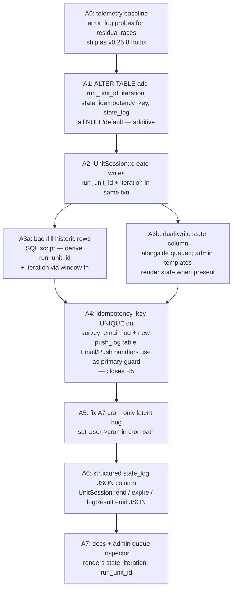

# Refactor plan: unit-session lifecycle and queue

Status: draft, pre-implementation. Owner: discuss before any code lands.

## TL;DR — recommended scope

After three rounds of fixes (v0.25.5/6/7) and a careful reading of the
code, the right move now is **not** the major-version rewrite this
document originally proposed. It's a smaller, non-breaking hardening
pass that captures the high-value wins from the analysis below, leaving
the deeper structural rewrite as an explicitly-deferred follow-up.

- v0.25.6 + v0.25.7 already plug every race observed in prod (R1, R2,
  R3, R4, R10 — see §races).
- The remaining wins fall cleanly into two tracks.

| | Track A (recommended now) | Track B (deferred, may never ship) |
|---|---|---|
| Version | v0.26.0 — minor | v1.0.0 — major |
| Effort | ~2 weeks | ~6–10 weeks |
| Breaking? | No. Additive schema, dual-write, no behaviour change for participants or self-hosters | Yes. Schema cutover, queue rewrite, deployment changes |
| Captures | D1 `run_unit_id`, D2 `iteration`, D3 named `state` enum, D4 idempotency keys (closes R5), A7 latent bug, structured `state_log`, telemetry baseline | New `unit_executions` + `work_items` tables, `RunSessionDispatcher`, multi-worker via `FOR UPDATE SKIP LOCKED`, drop `queued` magic column |
| Blocked by | Nothing | Multi-worker becoming a real requirement, OR the Track-A `state` column drifting from `queued` enough to be confusing |

Track A captures the analysis-side pain (`run_unit_id` ambiguity in
exports, magic queue-state values) and closes the last actual
correctness gap (R5: cascade interrupt → on-restart double-send) without
any operational change for self-hosters or external schema consumers.
Track B is operational scaling, not correctness; defer until either
prod hits a scale where one `formr_run_daemon` is the bottleneck, or
horizontal worker scaling becomes a stated requirement. Today the §10
"open questions" admit "for our scale … one table is fine".

Crucially, Track A's `state` column + `idempotency_key` are exactly the
wire format Track B would need anyway. Track A is a strictly-incremental
step toward Track B *if and when* Track B becomes justified — there's
no rework, only addition.

## Goal

Today's `survey_unit_sessions` table conflates three roles: (1) the
queue of pending work for the cron daemon, (2) the per-participant
history of unit executions, and (3) the live state of the active
participant flow (`current_unit_session_id`, `position`). The
v0.25.6 / v0.25.7 fixes plugged real bugs at the leaf level (W4.a
expiry, stale-reference cascade, supersede-orphan, position-race,
non-idempotent send) but every fix was a defensive guard layered on
top of a single overloaded data structure. Each guard added another
implicit invariant — `queued != -9` here, `ended IS NULL AND
expired IS NULL` there, `reloadFromDb()` after lock — and the
invariants now interact in ways that are hard to reason about
without staring at five files in parallel.

Goal: redesign so the four concepts are independent.

- **Definition.** A `RunUnit` describes one step of a Run (Survey,
  Pause, Email, …). Static; admin-edited.
- **Execution.** A `UnitExecution` row records ONE participant's
  ONE attempt to run that unit. Has a state machine. Terminal.
- **Queue.** A `WorkItem` row is a job for a worker — execute /
  expire-check / send-email / send-push. Claimed via `SELECT … FOR
  UPDATE SKIP LOCKED`. Disposable.
- **Live participant pointer.** A `RunSessionPosition` row (or
  column on `survey_run_sessions`) names the currently-active
  `UnitExecution` plus its run-level `position`. Single source of
  truth.

That endpoint is Track B. **Track A keeps the same table**, adds the
columns the new model would need anyway (`run_unit_id`, `iteration`,
`state`, `idempotency_key`, `state_log`), and pivots all new writes to
populate them — a strictly-additive schema change with no operational
consequences. If Track B never ships, Track A's columns stand on their
own as a cleaner audit trail and a real fix for the export-side D1
ambiguity.

## Non-goals

- Rewriting Survey rendering (`Survey::processStudy`, paged
  rendering, OpenCPU integration). Those are orthogonal.
- Replacing MariaDB with anything else. Postgres has nicer queue
  primitives but the operational delta isn't worth the disruption
  for this codebase.
- Replacing the formr admin UI's unit editor. Admin-side stays.
- Changing the participant URL contract (`/run-name/?code=…`).
- Touching SkipForward/SkipBackward semantics — they keep producing
  multiple unit-executions for the same `unit_id`. Track A's
  `iteration` column represents that explicitly, but the run-author-
  facing behaviour is unchanged.

## Current architecture (concise)

### Tables

- `survey_units` — unit definitions (id, type, position-irrelevant).
- `survey_run_units` — links a unit to a run at a position.
- `survey_studies`, `survey_pauses`, `survey_pages`, `survey_emails`,
  `survey_push_messages`, `survey_externals`, `survey_branches`,
  `survey_shuffles`, `survey_waits` — per-type configuration.
- `survey_run_sessions` — one row per participant per run. Fields:
  `id`, `session` (token), `run_id`, `position`, `current_unit_session_id`,
  `ended`, `last_access`, `created`.
- `survey_unit_sessions` — the focus of this refactor. Fields:
  `id`, `unit_id`, `run_session_id`, `created`, `expires`, `queued`,
  `result`, `result_log`, `ended`, `expired`. Doubles as queue +
  history + active-state.
- `survey_email_log` — proper queue for email sending. `status` flag,
  `created`/`sent` timestamps. Decoupled from `survey_unit_sessions`
  but linked via `session_id`. **This is the model the rest of the
  refactor generalises.**
- `survey_items_display` — per-render per-item state for Survey units.

### Unit types

`RunUnitFactory::SupportedUnits` — `Survey`, `Pause`, `Email`,
`PushMessage`, `External`, `Page`, `SkipBackward`, `SkipForward`,
`Shuffle`, `Wait`. (`Branch` is an internal base class for the two
Skip variants and is not user-selectable.) Their behaviours, in one
line each:

- **Survey** — renders a form, accepts POSTs, ends when complete or
  when the X/Y/Z expiry algorithm fires.
- **Pause** — waits until a wall-clock or relative time, then
  cascades to the next unit.
- **Email** — sends one mail (sync or via the email queue), then
  cascades. Has a `cron_only` flag.
- **PushMessage** — sends one web-push notification, then cascades.
  No `cron_only` equivalent; always fires on whichever path runs it.
- **External** — redirects the participant to an external URL.
- **Page** (a.k.a. Endpage) — terminal; renders the run's final
  page.
- **SkipForward / SkipBackward** — evaluate an OpenCPU R expression
  yielding TRUE/FALSE; on TRUE, set `position` to a target unit and
  cascade. SkipBackward is the back-jump primitive that legitimately
  produces multiple `unit_id` instances per run-session.
- **Shuffle** — picks one of N branches at random and `run_to`s it.
- **Wait** — `Pause`-like but with an OpenCPU-driven condition
  rather than a wall-clock. Effectively deprecated; see callsites.

### Execution paths

Two callers can drive `RunSession::execute()`:

- **Web request.** `RunController::run` instantiates `RunSession`
  from the participant's session token, calls `execute()` with no
  reference. Lock timeout 10 s.
- **Cron daemon.** `bin/queue.php -t UnitSession` runs
  `UnitSessionQueue::processQueue` in a loop. Each pickup
  instantiates a fresh `RunSession`, calls
  `execute($referenceUnitSession, $executeReferenceUnit)`. Lock
  timeout 0.1 s (effectively zero).

Inside `execute()` the dispatch is:

1. `acquireLock('run_session_<id>', $timeout)` — fail-fast for cron,
   wait-then-fail for web.
2. `reloadFromDb()` (added v0.25.7) — refresh `position`, `ended`,
   `current_unit_session_id`.
3. `if ($this->ended)` — handle ended-run-session paths.
4. `getCurrentUnitSession()` — derives "current" by querying
   `survey_unit_sessions` filtered by `unit_id = at_position(position)
   AND ended IS NULL AND expired IS NULL AND queued != -9`
   `ORDER BY id DESC LIMIT 1`.
5. Three-way dispatch based on (referenceUnitSession, currentUnitSession):
   - **END-q**: ref==current, !executeRef → `endCurrentUnitSession()`
     + `moveOn()`.
   - **stale-reference**: ref!=current → `removeItem(ref.id)`,
     return `body=''`.
   - **currently-active**: no-ref or executeRef-true → recurse into
     `executeUnitSession()`.
6. `executeUnitSession()` calls the unit's `execute()`, dispatches
   on the result keys (`expired` / `end_session` / `queue` /
   `wait_user` / `wait_opencpu` / `redirect` / `run_to` / `move_on`
   / `end_run_session` / `content`).

### Cascade

A single `moveOn()` from Pause(124) recursively: end current → set
`position = getNextPosition(current)` → `createUnitSession(nextUnit)`
→ recursive `execute()` (with lock held, reentrant via MariaDB
GET_LOCK on same connection) → `executeUnitSession()` → next unit's
execute → returns end_session+move_on or move_on → end → moveOn …

This unrolls 124→127→128→129 in one PHP call stack under one lock.

### Queue pickup

```sql
SELECT survey_unit_sessions.id, …
FROM survey_unit_sessions
LEFT JOIN survey_run_sessions ON …
LEFT JOIN survey_runs ON …
WHERE queued >= :queued AND survey_runs.cron_active = 1
  AND expires <= NOW()
ORDER BY RAND();
```

`queued` semantics:

- `0` — not in queue. Either never queued (e.g. Email after `end()`),
  or the participant is in flight.
- `1` — `QUEUED_TO_EXECUTE`. Re-queued for retry (Pause/Branch
  check_failed; OpenCPU error; re-runs `executeUnitSession` via the
  fall-through branch instead of END-q).
- `2` — `QUEUED_TO_END`. Normal "wait until expires, then cron will
  process". The default for Pause/Survey-with-Z/etc.
- `-9` — `QUEUED_SUPERCEDED`. A sibling row with the same `unit_id`
  was created (back-jump iteration; `UnitSession::create` flips
  prior queued siblings to -9).

## Assumptions the current codebase relies on

These are not all written down anywhere. They emerge from reading.
The refactor needs to make them explicit (preserve where load-bearing,
discard where they have caused bugs).

A1. **Single cron worker.** `formr_run_daemon` is one container,
    one process. The cursor uses `ORDER BY RAND()` with no
    pagination, no `FOR UPDATE`. Two daemons would corrupt state.

A2. **Reentrant run-session lock.** `MariaDB GET_LOCK` on the
    same connection from the same name is reentrant; nested
    `execute()` calls from `moveOn()` succeed without blocking.

A3. **`survey_run_sessions.position` advances monotonically** in
    almost all cases, with the back-jump primitives (SkipBackward,
    Wait, runTo from Branch) explicitly resetting it.

A4. **Only one `unit-session` row per `(run_session, unit_id)`
    has `ended IS NULL AND expired IS NULL AND queued != -9`** at
    a time. Violating this — which only the Survey-rate-limit and
    bookmarked-URL re-entry paths historically did, and the
    position-race path discovered in v0.25.7 — produces ambiguous
    `getCurrentUnitSession` answers.

A5. **`UnitSession::create` is a transaction-bracketed atomic
    advance** (insert + supersede siblings + set
    `current_unit_session_id`). Any rollback returns control to
    the caller without partial state.

A6. **`MariaDB autocommit` is on for everything outside of explicit
    `beginTransaction`.** Each `end()`, `expire()`, `save()` UPDATE
    is its own committed write. No multi-row atomicity unless a
    transaction is open. In particular, `moveOn()`'s position-UPDATE
    + createUnitSession + cascade is a sequence of separately-
    committed writes; partial failure leaves partial state.

A7. **`isExecutedByCron()` returns `runSession->user->cron`, and
    `User::$cron` is never set to true anywhere in the codebase.**
    The `Email::cron_only` gate therefore always treats every
    request as user-driven. This is a latent bug; `cron_only=true`
    emails are still sent from cron paths because the `!isCron`
    test fires on web AND cron. Tests in v0.25.6 confirmed this
    incidentally. **Fix in Track A (A5 step).**

A8. **The `survey_email_log` queue is single-worker
    (`formr_mail_daemon`).** It does NOT use `FOR UPDATE`. Multi-
    worker would double-send.

A9. **PushMessage has no separate queue.** Each unit-session's
    `getUnitSessionOutput` calls `PushNotificationService::sendPushMessage`
    inline. No retry. No idempotency at the row level pre-v0.25.7.
    **Fix in Track A (A4 step) by introducing `push_log`.**

A10. **`expires <= NOW()` is the only queue-readiness signal.** No
     priority, no SLAs, no separate "ready" flag. Pause and
     Survey-with-Z both write `expires` to the same column and
     compete for the same cron pickup.

A11. **`survey_unit_sessions.id ORDER BY DESC LIMIT 1`** is the
     "latest sibling" tie-breaker. This is fine because rows are
     append-only, but it means `getCurrentUnitSession`'s answer
     can shift mid-cascade (a fresh `create()` in cascade #N
     becomes the new "current" for cascade #N+1's queries).

A12. **Cron-active-but-paused runs never appear in cursor** because
     `survey_runs.cron_active = 1` is a hard filter. Toggling
     cron_active off freezes the run for the queue but leaves
     queued rows lingering.

## Data-model issues (non-race)

These aren't race conditions; they're places where the data model
under-specifies what happened, so downstream consumers (analysis
exports, merged result tables, the admin queue inspector) have to
reconstruct context that the unit-session row should have carried
in the first place.

D1. **Unit-session has `unit_id` but not `run_unit_id`.** When a
    Survey is reused at multiple positions in a run (e.g.
    `T1_Screening` at positions 10, 30, 50), each position is a
    distinct row in `survey_run_units` (which already has its own
    PK `id` and is referenced as `$run_unit_id` in PHP via
    `RunUnit::$run_unit_id`), but `survey_unit_sessions` only
    stores `unit_id`. Three fills of the same Survey by the same
    participant produce three `survey_unit_sessions` rows that
    look identical except for `created` timestamp; you cannot tell
    which row corresponds to which position without ordering or
    guesswork. The only place that even tries to recover position
    is `UnitSession::getRunDataNeeded` (line 624 of
    `UnitSession.php`):

    ```sql
    LEFT JOIN survey_run_units
       ON survey_unit_sessions.unit_id = survey_run_units.unit_id
    LEFT JOIN survey_runs ON survey_runs.id = survey_run_units.run_id
    ```

    — and that JOIN is ambiguous: it fans out to N rows per
    unit-session when the unit is reused at N positions. Symptoms
    in prod: duplicates in merged result-table exports, ambiguous
    "which iteration of `T1_Screening` did this answer come from"
    questions during analysis. **Fix in Track A (A1 + A2 + A3a).**

D2. **`iteration` not captured today.** SkipBackward loops produce
    multiple `survey_unit_sessions` rows for the same
    `(run_session, run_unit)` pair; the only way to distinguish
    them is `id` order or `created` timestamp. ESM-style runs
    that loop a day's units for 7 days (AMOR's `T1_ESM_repetition_loop
    (for 7 days)` at position 143) produce 7 fills per ESM
    survey; analysts reconstruct day-of-loop from timestamps.
    **Fix in Track A (A1 + A2 + A3a).** `iteration` (1, 2, 3, …)
    explicitly counts completions of the same `run_unit_id`.

D3. **`survey_unit_sessions.queued`'s four magic values aren't
    self-documenting.** A SQL audit query needs to know that `-9`
    means "superseded sibling", `1` means "retry / executeRef",
    `2` means "waiting for cron pickup", `0` means three different
    things. **Fix in Track A (A3b).** Replace with explicit `state`
    enum on `survey_unit_sessions` (dual-written alongside `queued`
    for backwards compatibility).

D4. **No idempotency keys.** Email/Push are deduped by inspecting
    `result IN (terminal_set)` (v0.25.7 guards). Survey
    completion is deduped by `ended IS NULL` UPDATE WHERE clause
    (Hygiene 4). Both work in practice but neither is named or
    enforced at the schema level. **Fix in Track A (A4).**
    `idempotency_key UNIQUE` on `survey_email_log` and the new
    `push_log` table; `INSERT ... ON DUPLICATE KEY UPDATE id = id`
    in the producer.

D5. **`result_log` is unstructured TEXT.** Mixed format
    (sometimes JSON, sometimes plain text, sometimes empty).
    Consumers parse it inconsistently. **Fix in Track A (A6),
    additive.** New `state_log JSON` column with documented schema
    per state-reason; legacy `result_log` keeps being written.

D6. **Per-study results table joins on `session_id` (which IS
    `unit_session_id`) but exports merge across units by
    `run_session_id`.** Without `run_unit_id` on the unit-session
    row, merging `survey_<screeningstudy>` with `survey_<esmstudy>`
    for the same participant requires reconstructing position from
    `survey_run_units` and timestamps. Fragile. Fixing D1 fixes
    this transitively because the new `run_unit_id` column lets
    the merge join through that.

## Race conditions inventory

R1. **Position-race (FIXED v0.25.7).** Two web requests' RunSession
    constructors load `position` before either acquires the lock.
    Second-to-acquire drives `moveOn` from cached stale position
    → duplicate downstream cascades. Fix: `reloadFromDb()` after
    `acquireLock`.

R2. **Stale-reference cascade (FIXED v0.25.6).** Cron's cursor
    pickup of a queued sibling whose run-session has advanced past
    it. Pre-v0.25.6 the line-247 branch called `moveOn()` and
    cascaded again. Fix: `removeItem` only.

R3. **Supersede-orphan blanket scope (FIXED v0.25.6).**
    `UnitSession::create` flipped EVERY queued sibling to -9, not
    just same-`unit_id`. Fix: WHERE clause scoped.

R4. **Email/Push double-send via re-execute (FIXED v0.25.7).** No
    row-level idempotency. Fix: bail when `result` is terminal.

R5. **Daemon kill mid-cascade.** SIGKILL between Email row create
    and end() leaves Email in `(created, ended IS NULL, queued=0,
    result=NULL)`. The cascade is half-done. On restart, no
    cursor pickup (queued=0); the orphan stalls until the next web
    request advances position. **Fix in Track A (A4):**
    `idempotency_key UNIQUE` on `survey_email_log` makes the
    on-restart re-INSERT a no-op; the v0.25.7 result-list guard
    catches the secondary case where the row exists with a non-NULL
    `result`.

R6. **Multi-process daemon.** Today blocked by single-container
    deployment. If anyone scales `formr_run_daemon` to >1 replica,
    cursor races explode (no `FOR UPDATE`). Mitigated only by
    convention. **Track B; do not multi-worker until then.**

R7. **Cron tick + user request lock contention.** Cron's 0.1 s
    timeout means cron always loses to user requests. If user
    requests dominate (high traffic), cron can starve. Today cron
    is single-process; if a participant holds the lock for a slow
    Survey render (OpenCPU evaluation, large body parse, network),
    cron skips them and tries again 15 s later. Acceptable but
    wastes daemon ticks. Note: multi-worker does **not** relieve
    this — multiple workers contend for the same per-run-session
    lock. The mitigation if it ever bites is per-run sharding
    (keyed pool), not pool size.

R8. **`current_unit_session_id` vs derived current.** Two sources
    of truth. `RunSession::execute`'s ended-branch line 207 uses
    `current_unit_session_id` directly; everywhere else uses
    `getCurrentUnitSession()` which derives from `position`. They
    can disagree mid-cascade. Hasn't bitten in prod that we know
    of; latent. Track B addresses by making the pointer the single
    source of truth.

R9. **`mail_daemon` retry on PHPMailer failure** (EmailQueue.php:254)
    can deliver twice when SMTP transport reports failure but the
    relay actually accepted. Not a code bug, an SMTP-protocol
    quirk. Mitigation: idempotency at the SMTP-relay level (the
    relay should dedupe on Message-ID), or by tracking
    `survey_email_log.status` more granularly. Out of scope.

R10. **Survey expires recomputed on every render.** A
     `survey_unit_sessions.expires` value is not stable across
     renders — `Survey::queue()` calls `addItem` which UPDATEs
     expires every time the participant POSTs/GETs. The `last_active`
     sliding deadline is implemented this way. Means:
     `window.unit_session_expires` shown to the client at render
     N can be wrong by render N+1. Caught by the v0.25.6 J5 test.

R11. **MariaDB connection drop during cascade.** GET_LOCK auto-
     releases when the connection dies. If the daemon's connection
     drops mid-`moveOn`, lock releases, partial state remains. A
     fresh request can acquire and re-cascade. The v0.25.7 fix
     reduces blast radius (idempotency + position-recheck) but
     doesn't eliminate. Track A's idempotency_key on email/push
     further reduces it; Track B's atomic state-transition TX
     would close it.

R12. **`processQueue` cursor staleness.** Cursor's snapshot is
     taken at SELECT time; rows may have been ENDED by another
     process during iteration. The cursor still hands them to
     `runSession.execute()`; the lock + `getCurrentUnitSession`
     re-read catches it. Wastes work but doesn't corrupt.

## Track A — v0.26.0 hardening (RECOMMENDED)



### A0. Telemetry baseline

Before touching anything, instrument the existing code to count
race-condition occurrences in prod. Lets us verify v0.25.7's R1 fix
held and gives a baseline for measuring A1+. New `error_log` calls
when:

- `getCurrentUnitSession` returns null at a non-first position
  (suggests cascade gap).
- `endCurrentUnitSession()` returns false (race with another path
  ending first).
- `moveOn` fires while `position` differs from
  `survey_run_sessions.position` (would catch any residual
  position-race).
- `survey_email_log.status` was 1 when a fresh send was attempted
  for the same `session_id` (would catch idempotency-bypass paths).

Ship as v0.25.8 hotfix. Watch for a week.

### A1. Schema additions (one Atlas patch)

All NULL/default — additive, no destructive ops, no migration risk.

```sql
ALTER TABLE survey_unit_sessions
  ADD COLUMN run_unit_id     INT UNSIGNED NULL,
  ADD COLUMN iteration       INT UNSIGNED NULL DEFAULT 1,
  ADD COLUMN state           ENUM('PENDING','RUNNING','WAITING_USER',
                                  'WAITING_TIMER','ENDED','EXPIRED',
                                  'SUPERSEDED') NULL,
  ADD COLUMN state_log       JSON NULL,
  ADD COLUMN idempotency_key VARCHAR(128) NULL,
  ADD UNIQUE KEY idemp_unit  (idempotency_key),
  ADD KEY idx_run_unit       (run_session_id, run_unit_id, iteration),
  ADD CONSTRAINT fk_uxec_run_unit FOREIGN KEY (run_unit_id)
                                  REFERENCES survey_run_units(id);

ALTER TABLE survey_email_log
  ADD COLUMN idempotency_key VARCHAR(128) NULL,
  ADD UNIQUE KEY idemp_email (idempotency_key);

CREATE TABLE push_log (
    id              BIGINT UNSIGNED PRIMARY KEY AUTO_INCREMENT,
    unit_session_id INT UNSIGNED NOT NULL,
    subscription_id INT UNSIGNED NULL,
    payload         JSON NOT NULL,
    status          ENUM('queued','sending','sent','failed') NOT NULL DEFAULT 'queued',
    idempotency_key VARCHAR(128) NULL UNIQUE,
    created         DATETIME NOT NULL,
    sent            DATETIME NULL,
    failed_at       DATETIME NULL,
    last_error      TEXT NULL,
    KEY (status, created),
    CONSTRAINT fk_push_log_unit_session FOREIGN KEY (unit_session_id)
        REFERENCES survey_unit_sessions(id) ON DELETE CASCADE
);
```

`state` co-exists with `queued` during Track A — both are dual-written
by application code (no triggers; the dual-write trigger phase the
original plan proposed is a self-inflicted source of desync risk and
is dropped). `queued` remains the queue-pickup signal — Track A does
not change `UnitSessionQueue::processQueue`'s SQL.

### A2. Forward writes

Patch `UnitSession::create()`
(`application/Model/UnitSession.php:51-89`) to populate `run_unit_id`,
`iteration`, and `state` inside the existing transaction:

- `run_unit_id` from a new `RunSession::getRunUnitIdAtPosition($position)`
  helper that queries `survey_run_units.id` (sister to the existing
  `getUnitIdAtPosition` at `RunSession.php:407`).
- `iteration` computed with
  `(SELECT COALESCE(MAX(iteration),0)+1 FROM survey_unit_sessions
     WHERE run_session_id = ? AND run_unit_id = ?)` inside the same
  TX. The existing `beginTransaction` already brackets the insert and
  the supersede-siblings update, so this read-then-insert is safe
  against the obvious race (the supersede update would conflict
  anyway).
- `state = 'PENDING'` on insert; `UnitSession::end / expire / queue`
  transition to `ENDED / EXPIRED / WAITING_TIMER / WAITING_USER` as
  appropriate, alongside the existing `queued` updates.

### A3a. Backfill historic rows

One-shot SQL script in `sql/patches/`:

```sql
-- Unique-position case (the common one): one matching survey_run_units
-- row per (run, unit_id), so the JOIN is unambiguous.
UPDATE survey_unit_sessions us
JOIN survey_run_sessions rs  ON rs.id = us.run_session_id
JOIN survey_run_units sru    ON sru.run_id = rs.run_id
                            AND sru.unit_id = us.unit_id
JOIN (
    -- only update where the unit appears at exactly one position in the run
    SELECT run_id, unit_id
    FROM survey_run_units
    GROUP BY run_id, unit_id
    HAVING COUNT(*) = 1
) uniq ON uniq.run_id = sru.run_id AND uniq.unit_id = sru.unit_id
SET us.run_unit_id = sru.id
WHERE us.run_unit_id IS NULL;

-- Iteration: one ROW_NUMBER per (run_session_id, unit_id) ordered by id.
UPDATE survey_unit_sessions us
JOIN (
    SELECT id,
           ROW_NUMBER() OVER (PARTITION BY run_session_id, unit_id
                              ORDER BY id) AS rn
    FROM survey_unit_sessions
) ranked ON ranked.id = us.id
SET us.iteration = ranked.rn
WHERE us.iteration IS NULL OR us.iteration = 1;

-- Multi-position-reuse case stays NULL and is flagged in state_log
-- for analyst awareness:
UPDATE survey_unit_sessions us
SET us.state_log = JSON_OBJECT('backfill', 'run_unit_id_ambiguous',
                               'reason',   'multi_position_reuse')
WHERE us.run_unit_id IS NULL;

-- Backfill report — run after the UPDATEs:
SELECT
    rs.run_id,
    SUM(us.run_unit_id IS NOT NULL) AS backfilled_unique,
    SUM(us.run_unit_id IS NULL)     AS unresolved
FROM survey_unit_sessions us
JOIN survey_run_sessions rs ON rs.id = us.run_session_id
GROUP BY rs.run_id
ORDER BY unresolved DESC;
```

Hosts with significant `unresolved` counts get a manual-review pass
before any consumer (export tooling, admin merge UI) starts depending
on `run_unit_id`. Greenfield deployments are trivially fine — A2
already fills all new rows.

### A3b. Named constants + dual-write state column

Three artefacts:

- The four magic values of `queued` already have constants on
  `UnitSessionQueue` (`QUEUED_TO_EXECUTE`, `QUEUED_TO_END`,
  `QUEUED_NOT`, `QUEUED_SUPERCEDED` —
  `application/Queue/UnitSessionQueue.php:14-17`). Audit call-sites
  for any remaining literal `0`/`1`/`2`/`-9` and replace.
- New `state` column written from `UnitSession::create / end /
  expire / queue` alongside the existing `queued` updates.
- Admin queue inspector templates (`templates/admin/run/sessions_queue
  .php:53`, `templates/admin/advanced/runs_management_queue.php:50`)
  learn to render the new `state` column when present, falling back
  to the `queued` magic mapping for legacy rows.

### A4. Idempotency keys (closes R5)

The remaining real correctness gap.

- `survey_email_log` insert in `Email::queueNow`
  (`application/Model/RunUnit/Email.php:245-262`) computes
  `idempotency_key = "email:{unit_session_id}:{email_id}"` and uses
  `INSERT ... ON DUPLICATE KEY UPDATE id = id`. Daemon-kill mid-cascade
  → restart re-attempt → the duplicate INSERT is a no-op → no
  double-send.
- `PushMessage::getUnitSessionOutput`
  (`application/Model/RunUnit/PushMessage.php:114-191`) inserts a
  `push_log` row with
  `idempotency_key = "push:{unit_session_id}"` BEFORE calling
  `PushNotificationService::sendPushMessage`. On success, update the
  row's `status='sent'`. On restart, the duplicate INSERT no-ops and
  the handler bails on the existing-row check. The existing v0.25.7
  `result IN (terminal)` guard stays as belt-and-braces.

This closes R5 properly — the v0.25.7 result-list guard is good but
doesn't survive a SIGKILL between row INSERT and `result` UPDATE.

### A5. Fix A7 cron_only latent bug

Set `User->cron = true` in the cron path. The simplest fix is in
`UnitSessionQueue::processQueue` (`application/Queue/UnitSessionQueue.php`)
right after instantiating `RunSession`, before calling `execute()`:
`$runSession->user->cron = true;`. Two-line change, fixes a documented
latent bug (Email::cron_only flag currently no-ops on cron because
`User::$cron` is never set).

Add an e2e test that asserts `cron_only=true` Email is NOT sent from a
user-driven web request, and IS sent from a cron tick.

### A6. Structured state_log

Backwards-compatible: existing `result_log` text column stays. New
writes go to both — `result_log` keeps the human-readable string,
`state_log` gets `{"reason": "...", "ctx": {...}}`. Document the JSON
shape per state-reason in a doc-block on `UnitSession::logResult`.

### A7. Docs + admin updates

Update CHANGELOG.md, document the v0.26.0 schema additions, refresh
the admin queue inspector to show `state`/`iteration`/`run_unit_id`.

### What Track A does NOT touch (intentional)

- `RunSession::execute()` stays as-is — the existing 100-line dispatch
  with `reloadFromDb()` + 3-way ref/current dispatch keeps working.
  The v0.25.7 fix made it correct; refactoring it to a state-machine
  dispatcher is a code-quality win, not a correctness one.
- `UnitSessionQueue::processQueue` keeps `ORDER BY RAND()` and no
  `FOR UPDATE`. Single-worker semantics preserved.
- No new `unit_executions` table. No dual-write triggers. No feature
  flag rollout. CI matrix stays one-axis.
- `survey_unit_sessions` keeps its name and shape. `queued` column
  stays. External readers (admin tools, runbooks, exports) keep
  working.
- `current_unit_session_id` vs derived-current (R8) stays as-is —
  latent, hasn't bitten.

## Track B — deferred breaking refactor

This is the original "vNext, major" plan, retained for context but
explicitly deferred. Each item lists the trigger that would justify
ship.

### Track B.1. `unit_executions` table

Replaces `survey_unit_sessions` for runtime state (history + active
pointer). Append-only after creation; state transitions are explicit
in the `state` column with timestamps. Schema as in the original
proposed-architecture section below.

**Justified by:** carrying both Track A's `state` enum and the legacy
`queued` column starts to feel like two sources of truth, OR external
schema consumers (analysis pipelines reading `survey_unit_sessions.queued`
directly) need to be cut off cleanly with a major-version bump.

### Track B.2. `work_items` job queue

```sql
CREATE TABLE work_items (
    id              BIGINT UNSIGNED PRIMARY KEY AUTO_INCREMENT,
    kind            ENUM('expire_check','cascade_advance',
                         'send_email','send_push','external_callback') NOT NULL,
    target_id       BIGINT UNSIGNED NOT NULL,
    payload         JSON NULL,
    available_at    DATETIME(3) NOT NULL,
    claimed_at      DATETIME(3) NULL,
    claimed_by      VARCHAR(64) NULL,
    attempt_count   INT UNSIGNED NOT NULL DEFAULT 0,
    max_attempts    INT UNSIGNED NOT NULL DEFAULT 3,
    last_error      TEXT NULL,
    completed_at    DATETIME(3) NULL,
    failed_at       DATETIME(3) NULL,
    idempotency_key VARCHAR(128) NULL UNIQUE,
    KEY (available_at, claimed_at),
    KEY (target_id)
);
```

Decoupled from `unit_executions`'s history role.

**Justified by:** multi-worker scaling becomes a real requirement, OR
cron-vs-user lock contention starves cron in prod (R7 — currently
theoretical). Track A's idempotency_key on email/push already covers
the correctness implications; the work_items table is purely an
operational scaling investment.

### Track B.3. Multi-worker via `FOR UPDATE SKIP LOCKED`

```sql
SELECT id, kind, target_id, payload
FROM work_items
WHERE claimed_at IS NULL
  AND completed_at IS NULL AND failed_at IS NULL
  AND available_at <= NOW(3)
ORDER BY available_at, id LIMIT 1
FOR UPDATE SKIP LOCKED;
```

Three worker pools (cascade, mail, push) or one pool dispatching by
`kind`. Each is a docker service; scale via `docker compose up
--scale`.

**Justified by:** multi-worker. **Requires:** MariaDB 10.6+ across
all production hosts (verify before commit).

### Track B.4. `RunSessionDispatcher` + per-unit handlers

`RunSession::execute` becomes a thin shim that delegates to a
dispatcher class. Unit-type handlers (`SurveyHandler`, `PauseHandler`,
…) are extracted from `RunUnit::execute()` via a sister method
`RunUnit::transition($execution)` returning the next state +
side-jobs. Dispatcher writes to `unit_executions`. Cron daemon runs
against `work_items` exclusively.

**Justified by:** ongoing maintenance pain in `RunSession`'s
single-method dispatch. A code-quality investment, not bug-driven.
Track A leaves this method correct; rewriting it is taste, not
necessity.

### Track B state-machine reference

```
PENDING ──create()──► WAITING_USER  (Survey, Page, External)
                  └─► WAITING_TIMER (Pause, Wait)
                  └─► RUNNING       (Email, PushMessage, SkipForward,
                                     SkipBackward, Shuffle, Branch)
                                     synchronous; transitions to
                                     ENDED in same transaction

WAITING_USER  ──participant submits final page─► ENDED
              ──X+Y deadline hits──────────────► EXPIRED
              ──admin forceTo / supersede─────► SUPERSEDED

WAITING_TIMER ──waiting_until ≤ NOW────────────► ENDED   (Pause)
              ──admin forceTo / supersede─────► SUPERSEDED

RUNNING       ──unit completes synchronously──► ENDED
              ──unit returns deferred (Email
                queued, Push queued)─────────► ENDED (with side-job
                                                in work_items)
              ──worker fails permanently────► EXPIRED  (rare)

(All terminal states never transition out. Terminal write atomic.)
```

This is exactly the state set Track A's `state` column provisions for
— Track A is the strictly-incremental on-ramp.

## D2 diagram — current architecture

Save as `tests/refactor_queue_current.d2` and render with `d2`:

```d2
direction: right

participant: "Web request" {shape: person}
cron: "formr_run_daemon\n(single process)" {shape: hexagon}

run_session: "RunSession::execute()" {
  shape: rectangle
  style.fill: "#fef3c7"
  acquire_lock: "GET_LOCK\nrun_session_<id>\nweb=10s, cron=0.1s" {shape: cloud}
  reload: "reloadFromDb()\n(v0.25.7)" {shape: cloud}
  current: "getCurrentUnitSession()\nORDER BY id DESC" {shape: cloud}
  dispatch: "3-way dispatch\non (ref, current)" {shape: diamond}
  acquire_lock -> reload -> current -> dispatch
}

end_q: "END-q branch:\nendCurrentUnitSession()\n+ moveOn()" {shape: rectangle}
stale: "stale-reference branch:\nremoveItem()\nreturn body=''" {shape: rectangle}
active: "currently-active:\nexecuteUnitSession()" {shape: rectangle}

run_session.dispatch -> end_q: "ref==current\n!executeRef"
run_session.dispatch -> stale: "ref!=current"
run_session.dispatch -> active: "no-ref OR\nexecuteRef=true"

unit_session_table: "survey_unit_sessions\n(history + queue + active)" {
  shape: cylinder
  style.fill: "#fee2e2"
}

unit_session_table.queued_2: "queued=2 (waiting cron)"
unit_session_table.queued_1: "queued=1 (retry / executeRef)"
unit_session_table.queued_0: "queued=0 (in-flight participant\nor terminal)"
unit_session_table.queued_minus9: "queued=-9 (superseded sibling)"

participant -> run_session: HTTP GET/POST
cron -> run_session: cursor pickup\nWHERE queued > 0\nAND expires <= NOW()
unit_session_table -> cron: ORDER BY RAND()

active -> unit_execute: "calls"
unit_execute: "RunUnit::getUnitSessionOutput()\nper unit type" {
  shape: rectangle
  style.fill: "#dbeafe"
  survey: "Survey: render form / processStudy\nreturns content / end_session+move_on"
  pause: "Pause: getUnitSessionExpirationData\nreturns content + queue:{expires, queued=2}\nor expired+end_session+move_on"
  email: "Email: sendMail (queueNow → mail_log\nor sendNow inline)\nreturns end_session+move_on"
  push: "PushMessage: sendPushMessage\nreturns move_on (no end_session!)"
  external: "External: redirect URL"
  page: "Page (Endpage): render"
  branch: "SkipForward/Backward/Shuffle:\nrun_to=position"
}

end_q -> moveOn
active -> moveOn: "result has\nmove_on / end_session"
moveOn: "RunSession::moveOn()" {
  shape: rectangle
  style.fill: "#fef3c7"
  advance: "position++"
  create: "createUnitSession(nextUnit)\n— transactional INSERT\n— supersede same-unit_id siblings\n  to queued=-9"
  recurse: "execute() recursive\n(reentrant lock)"
  advance -> create -> recurse
}
moveOn.recurse -> run_session: "loop while move_on"

mail_daemon: "formr_mail_daemon\n(separate process)" {shape: hexagon}
email_log: "survey_email_log" {shape: cylinder}
unit_execute.email -> email_log: queueNow INSERT
mail_daemon -> email_log: SELECT WHERE status=0\n(no FOR UPDATE)
mail_daemon -> smtp: "PHPMailer\n(retry once on failure)" {shape: cloud}
smtp -> recipient: SMTP

push_provider: "Apple/FCM push" {shape: cloud}
unit_execute.push -> push_provider: "inline\n(no queue, no retry)"

# Race annotations
race_R1: "R1: position-race\n(FIXED v0.25.7)" {style.fill: "#10b981"}
race_R5: "R5: daemon kill\nmid-cascade\n(Track A A4 closes)" {style.fill: "#f59e0b"}
race_R6: "R6: multi-worker\n(blocked by convention; Track B)" {style.fill: "#ef4444"}
race_R7: "R7: lock contention\nuser vs cron\n(latent)" {style.fill: "#f59e0b"}

run_session.acquire_lock -> race_R7
moveOn.recurse -> race_R5
cron -> race_R6
```

## D2 diagram — Track B end state (deferred)

Save as `tests/refactor_queue_proposed.d2`:

```d2
direction: right

participant: "Web request" {shape: person}

# Web request path: read-mostly, only commits when participant
# submits a final page.
web: "WebDispatcher::handle()" {
  shape: rectangle
  style.fill: "#dbeafe"
  read_only: "Read run-session pointer\n(no write before lock)" {shape: cloud}
  lock: "GET_LOCK\nrun_session_<id>" {shape: cloud}
  load: "Load UnitExecution\nFROM unit_executions WHERE id =\nrun_sessions.current_unit_execution_id" {shape: cloud}
  state_machine: "Dispatch on state" {shape: diamond}
  read_only -> lock -> load -> state_machine
}

worker_pool: "Worker pool\n(N replicas, claim via\nFOR UPDATE SKIP LOCKED)" {
  shape: hexagon
  cascade: "cascade-worker\n(handles expire_check\n+ cascade_advance)"
  mail: "mail-worker"
  push: "push-worker"
}

work_items: "work_items\n(jobs, transient)" {
  shape: cylinder
  style.fill: "#dcfce7"
}

unit_executions: "unit_executions\n(state machine, append-only)" {
  shape: cylinder
  style.fill: "#dcfce7"
  state_pending: "PENDING"
  state_running: "RUNNING"
  state_waiting_user: "WAITING_USER"
  state_waiting_timer: "WAITING_TIMER"
  state_ended: "ENDED (terminal)"
  state_expired: "EXPIRED (terminal)"
  state_superseded: "SUPERSEDED (terminal)"
}

run_session_pointer: "survey_run_sessions\n.current_unit_execution_id\n(single source of truth)" {shape: cylinder}

participant -> web: HTTP
web -> unit_executions: read state
web -> run_session_pointer: read pointer
web -> work_items: enqueue cascade_advance\non state-machine transition

worker_pool.cascade -> work_items: "FOR UPDATE SKIP LOCKED\nLIMIT 1"
worker_pool.cascade -> dispatcher
dispatcher: "CascadeDispatcher" {
  shape: rectangle
  style.fill: "#fef3c7"
  by_kind: "Dispatch by\nUnit type + state" {shape: diamond}
  survey_handler: "Survey handler"
  pause_handler: "Pause handler"
  email_handler: "Email handler"
  push_handler: "Push handler"
  branch_handler: "Branch / Skip handler"
  by_kind -> survey_handler
  by_kind -> pause_handler
  by_kind -> email_handler
  by_kind -> push_handler
  by_kind -> branch_handler
}

dispatcher.email_handler -> work_items: "enqueue send_email\n(idempotency_key=\nunit_exec.id+attempt)"
dispatcher.push_handler -> work_items: "enqueue send_push\n(idempotency_key=\nunit_exec.id+attempt)"

worker_pool.mail -> survey_email_log: "FOR UPDATE SKIP LOCKED"
worker_pool.push -> push_log: "FOR UPDATE SKIP LOCKED"

# Atomic cascade: each unit transition is one TX
tx_box: "Transaction boundary\n(single TX per state transition)" {
  shape: rectangle
  style.fill: "#fee2e2"
  start: "BEGIN"
  load_lock: "SELECT unit_executions ... FOR UPDATE"
  call_handler: "handler.transition()"
  insert_next: "INSERT next unit_execution if cascade"
  enqueue_jobs: "INSERT work_items for async work"
  commit: "COMMIT"
  start -> load_lock -> call_handler -> insert_next -> enqueue_jobs -> commit
}

dispatcher -> tx_box

idempotency: "Idempotency contract" {
  shape: rectangle
  style.fill: "#dcfce7"
  rule_1: "Each unit_execution row\nis processed AT MOST ONCE"
  rule_2: "Each work_item.idempotency_key\nis unique"
  rule_3: "send_email/send_push handlers\nbail if email_log/push_log\nrow is already 'sent'"
}

worker_pool -> idempotency
```

(Both diagrams are checked into `tests/` next to this plan; render
with `d2 tests/refactor_queue_proposed.d2 -o tests/refactor_queue_proposed.svg`
when needed for review.)

## Testing strategy

The v0.25.6 + v0.25.7 e2e suite (`tests/e2e/{survey-symptoms,survey-
expiry-matrix,survey-unfinished-pathways,survey-expiry-ui,double-
expiry}.spec.js`) is the regression baseline. Track A's columns are
additive and dual-written; the existing suite must pass unchanged
(no feature flag, no two-axis matrix).

New tests for Track A:

- **Backfill correctness.** Unit/integration test on a fixture DB
  asserting the A3a SQL produces expected
  `run_unit_id` / `iteration` values for: (a) unique-position runs,
  (b) multi-position-reuse runs (run_unit_id stays NULL,
  state_log notes ambiguity), (c) SkipBackward-loop runs (iteration
  counts up).
- **`cron_only` semantics.** e2e: `cron_only=true` Email is NOT sent
  on web request, IS sent on cron tick. Closes A7.
- **Crash-only Email idempotency.** SIGKILL the mail worker
  mid-`sendMail`; assert `survey_email_log` insert no-ops on retry
  (UNIQUE collision) and SMTP only sees one message. Closes R5.
- **Crash-only Push idempotency.** Same, for `push_log`.

Track B testing (when/if shipped) would add: worker idempotency
collision, multi-worker race on `FOR UPDATE SKIP LOCKED`, illegal
state-machine transitions throwing, and cascade-interrupt recovery.
Out of scope here.

## Risks (Track A)

- **Backfill produces wrong `iteration` for SkipBackward loops where
  the run was edited mid-flight.** The `ROW_NUMBER OVER (ORDER BY id)`
  is best-effort and assumes monotonic creation. Mitigation: backfill
  report flags suspicious runs; analyst confirms before trusting the
  iteration column. The legacy `result_log` text still carries the
  original audit trail.
- **`idempotency_key` collision in legacy data.** Backfill skips
  populating `idempotency_key` on existing email_log rows
  (only forward writes get keys). Retry-on-restart for an in-flight
  v0.25.x send falls back to the v0.25.7 result-list guard.
- **Atlas migration ordering on hosts running different versions.**
  Reserve patch numbers (`047_uxec_track_a.sql`, etc.) early; document
  the ordering. Each ALTER is independently reversible (DROP COLUMN)
  if rollback is needed.
- **Behaviour-preservation regression test surface.** Track A is
  schema-additive and dual-write; the existing e2e suite is the
  contract. Any spec failing post-A1 is a real bug, not a config
  drift.

## Risks (Track B, when/if shipped)

Retained from the original plan and out of scope until Track B is
scheduled:

- `FOR UPDATE SKIP LOCKED` requires MariaDB 10.6+. Verify across
  every production host before commit.
- Worker pool replaces a process operations docs reference by name.
  Runbooks need updates in lockstep with the cutover.
- Idempotency contract for deferred-execute (Email, Push) is a new
  shape — exhaustive crash-only tests required.
- Atlas migration runs out of order on hosts pinned to different
  versions. Reserve numbers early.

The original plan also proposed dual-write triggers between
`survey_unit_sessions` and a new `unit_executions` table; that approach
is discarded. Triggers desync silently, the diff query catches it
weekly at best, and the dual-write window during multi-week phased
rollout is exactly when the synthesis-of-truth bugs would be hardest
to debug. If Track B happens, do it as a single coordinated cutover
with a brief read-only window, not a months-long dual-write
maintenance burden.

## Effort estimate

- **Track A:** 8–12 working days for one engineer.
  - A0 telemetry: 1 day.
  - A1 schema patch: 1 day.
  - A2 forward writes (UnitSession::create, helpers): 1–2 days.
  - A3a backfill script + report: 1–2 days.
  - A3b state column + admin templates: 1–2 days.
  - A4 idempotency keys + push_log + handler updates: 2–3 days.
  - A5 cron_only fix + e2e test: half a day.
  - A6 structured state_log: half a day.
  - A7 docs + CHANGELOG: half a day.

- **Track B:** 6–10 weeks if ever scheduled. Original phased estimate
  retained as a guide. Not commit-ready until the trigger conditions
  in §Track B fire.

## Decision

Proceed with Track A as v0.26.0. No decision gate is required for
Track A — it's strictly additive and reversible per ALTER. Track B
remains parked; revisit when (a) operational scaling pressure
materialises, or (b) the dual-write `state` ↔ `queued` overhead
becomes a sustained source of bugs in its own right.